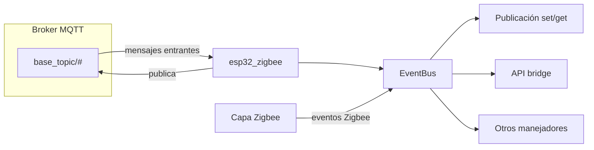

# Resumen: Relación con MQTT

## Modelo general

- **Prefijo**: todos los topics relativos se concatenan con `mqtt.base_topic` (por defecto `esp32_zigbee`); la publicación antepone siempre ese prefijo al topic relativo.
- **Suscripción única**: al conectar, el cliente MQTT se suscribe a `**${base_topic}/#`**. Así recibe **todo** lo publicado bajo el prefijo (incluidos los propios mensajes; los publicados con la opción interna que evita reprocesar se descartan al recibir para no crear bucles).
- **Entrada**: el manejador de mensajes entrantes reenvía el evento al bus interno de eventos. Varias **piezas de lógica** escuchan y **solo reaccionan** si el topic coincide con su patrón (por ejemplo: control `get`/`set` con una expresión regular que excluye `bridge`; la API del bridge reconoce `bridge/request/...`).




---

## 1. Mensajes que **publica** el programa (relación con la red Zigbee y estado)

### 1.1 Estado del bridge (LWT y conexión)

- **Topic**: `base_topic/bridge/state`
- **Payload** (JSON): `{"state":"online"}` al conectar; **testamento** MQTT (LWT): `{"state":"offline"}` si el cliente pierde la conexión sin un cierre ordenado.

**Ejemplo real**: Tras arrancar, el broker puede entregar retenido `{"state":"online"}` para que Home Assistant u otros integradores sepan que el bridge está activo.

### 1.2 Eventos de red / dispositivos

- **Topic**: `base_topic/bridge/event`
- **Origen**: cuando ocurren en la red Zigbee eventos como dispositivo unido, salida, anuncio o fases de la entrevista, se publica aquí un JSON con el tipo y los datos.

**Tipos habituales**:

- `device_joined` / `device_leave` / `device_announce`: `data` con `friendly_name` e `ieee_address`.
- `device_interview`: incluye `status` (`started`, `failed`, `successful`); si la entrevista termina bien, suelen aparecer también campos como `supported` y metadatos de la definición del dispositivo.

**Ejemplo real** (emparejamiento):

```json
{"type":"device_joined","data":{"friendly_name":"sensor_salon","ieee_address":"0x00158d0001234567"}}
```

**Ejemplo real** (entrevista OK):

```json
{"type":"device_interview","data":{"friendly_name":"bombilla_comedor","ieee_address":"0x90fd9ffffe123456","status":"successful","supported":true,"definition":{...}}}
```

### 1.3 Información persistente del bridge

Suelen publicarse con **retain** (y a veces sin log detallado): información agregada del bridge, listado de dispositivos, grupos y definiciones de clusters/acciones.


| Topic relativo       | Contenido típico                                                                         |
| -------------------- | ---------------------------------------------------------------------------------------- |
| `bridge/info`        | Versión, SO, MQTT, coordinador, red (PAN, canal), `permit_join`, configuración relevante |
| `bridge/devices`     | Lista JSON de dispositivos                                                               |
| `bridge/groups`      | Lista de grupos                                                                          |
| `bridge/definitions` | Clusters, clusters personalizados, acciones                                              |


### 1.4 Salud del sistema

- **Topic**: `bridge/health` — publicado periódicamente (intervalo configurable en la sección `health` de la configuración), con retain y QoS 1. Incluye carga del SO, memoria, estadísticas MQTT y métricas por dispositivo cuando aplica.

### 1.5 Logs vía MQTT (interfaz web / depuración)

- **Topic**: `bridge/logging` — mensajes de log serializados como JSON con campos como `message`, `level` y `namespace`.

### 1.6 Estado de **dispositivos y grupos** (flujo Zigbee → MQTT)

Cadena típica:

1. Tráfico Zigbee procesado por la pila → evento de mensaje de dispositivo → capa que **recibe** y convierte usando definiciones de **zigbee-herdsman-converters** (`fromZigbee`) → llamada a publicación de estado de entidad.
2. **Publicación de estado de entidad**: fusiona con la caché de estado si está activada (`cache_state`), puede añadir metadatos de dispositivo (`include_device_information`), `last_seen`, `linkquality`, aplicar filtros; según `advanced.output`:
  - `**json`** o `**attribute_and_json`**: un topic por entidad `base_topic/{friendly_name}` con un objeto JSON (orden estable al serializar).
  - `**attribute**` o `**attribute_and_json**`: subtopics `base_topic/{friendly_name}/{clave}` con valores en texto plano.

**Ejemplo real** (bombilla): topic `esp32_zigbee/luz_cocina`:

```json
{"state":"ON","brightness":200,"color_temp":370,"color_mode":"color_temp","linkquality":120,"last_seen":"2025-03-24T10:00:00.000Z"}
```

Con `include_device_information: true`, el mismo mensaje puede incluir un objeto `device` con modelo, IEEE, tipo de nodo, etc.

**Ejemplo real** (salida por atributos): `esp32_zigbee/luz_cocina/state` → `ON`; `esp32_zigbee/luz_cocina/brightness` → `200`.

### 1.7 Disponibilidad (si está habilitada)

- **Topic**: `base_topic/{friendly_name}/availability`
- **Payload**: `{"state":"online"}` o `{"state":"offline"}`.

### 1.8 Respuestas a peticiones MQTT

- **Patrón**: `base_topic/bridge/response/<mismo-segmento-que-la-petición>` — por ejemplo petición `bridge/request/permit_join` → respuesta `bridge/response/permit_join`.

### 1.9 Renombrado / borrado de entidad (retain)

- Tras renombrar o eliminar una entidad, puede publicarse un payload vacío con **retain** sobre el topic que antes usaba el nombre antiguo, para limpiar mensajes retenidos obsoletos en el broker.

---

## 2. Mensajes **entrantes** (suscripción `base_topic/#`) y qué desencadenan

Cada manejador filtra por topic; si no coincide, no hace nada.

### 2.1 Control de dispositivos / grupos: `get` y `set`

- El patrón de topics **no** incluye el segmento `bridge`; se reconocen formas equivalentes con `get` o `set` y nombre de dispositivo o grupo, con o sin endpoint y con o sin atributo en el path.
- **Formas**:
  - `base_topic/<nombre>/set` — cuerpo JSON con claves acordes a lo que expone el dispositivo (p. ej. `{"state":"ON","brightness":128}`).
  - `base_topic/<nombre>/set/<atributo>` — cuerpo = valor (JSON o texto).
  - Con endpoint: `base_topic/<nombre>/<endpoint>/set` (y variante con `/set/<atributo>`).

**Efecto**: se resuelve el dispositivo o grupo, se usan los conversores de la definición (`convertSet` / `convertGet`), se envían comandos Zigbee; con estado optimista puede actualizarse el estado local y republicarse por MQTT.

**Ejemplo real** (encender bombilla):

- Topic: `esp32_zigbee/luz_cocina/set`
- Payload: `{"state":"ON"}`

**Ejemplo real** (solo brillo vía subtopic):

- Topic: `esp32_zigbee/luz_cocina/set/brightness`
- Payload: `128` o `"128"`

### 2.2 API del bridge: `base_topic/bridge/request/<clave>`

Claves habituales (lista orientativa): `permit_join`, `restart`, `device/remove`, `group/add`, `backup`, `touchlink/scan`, `health_check`, `options`, y otras relacionadas con dispositivos, grupos y utilidades.

**Efecto**: ejecuta la acción correspondiente; publica JSON en `bridge/response/<clave>` con resultado o error.

**Ejemplo real** (abrir emparejamiento 254 s):

- Topic: `esp32_zigbee/bridge/request/permit_join`
- Payload: `{"value":true,"time":254}`

### 2.3 Otras peticiones bajo `bridge/request` (mismo bus MQTT)


| Patrón aproximado                                                               | Rol                                  | Efecto                                                                            |
| ------------------------------------------------------------------------------- | ------------------------------------ | --------------------------------------------------------------------------------- |
| `bridge/request/networkmap`                                                     | Mapa de red                          | Respuesta en `bridge/response/networkmap` (formatos como raw, graphviz, plantuml) |
| `bridge/request/device/configure`                                               | Configuración Zigbee del dispositivo | Ejecuta la rutina de configuración del dispositivo cuando existe                  |
| `bridge/request/group/members/add`, `remove`, `remove_all`                      | Membresía de grupos                  | Añade, quita o vacía pertenencia a grupos Zigbee                                  |
| `bridge/request/device/bind`, `unbind`, `binds/clear`                           | Enlaces                              | Crea, elimina o limpia enlaces entre endpoints/grupos                             |
| `bridge/request/device/ota_update/...`                                          | OTA                                  | Comprueba, programa o aplica actualizaciones de firmware según subruta            |
| `bridge/request/converter/save`, `remove` (y análogo para extensiones externas) | JS externo                           | Guarda o elimina convertidores o extensiones en carpeta de datos                  |


### 2.4 Home Assistant (descubrimiento)

Si la integración con Home Assistant está activa, el bridge puede **suscribirse también** al topic de descubrimiento de Home Assistant (p. ej. bajo `homeassistant/...`) para detectar configuraciones de descubrimiento y limpiar entradas obsoletas cuando aplica. No sustituye al control por `set`/`get` ni a la API `bridge/request`; es sincronización con el ecosistema de descubrimiento de HA.

---

## 3. Relación evento Zigbee → publicación MQTT (resumen)

- **Tráfico de red / ciclo de vida**: eventos de unión, entrevista, anuncio, etc. → publicación en `bridge/event` y actualización de topics retenidos tipo `bridge/devices` cuando corresponde.
- **Telemetría y acciones físicas**: mensaje Zigbee → conversión `fromZigbee` → publicación de estado en el topic del **friendly name** (y opcionalmente topics por atributo).
- **Comandos desde automatización**: MQTT `.../set` o `.../get` → conversión `convertSet`/`convertGet` → comandos Zigbee → (opcional) nuevo estado en el topic de la entidad.

